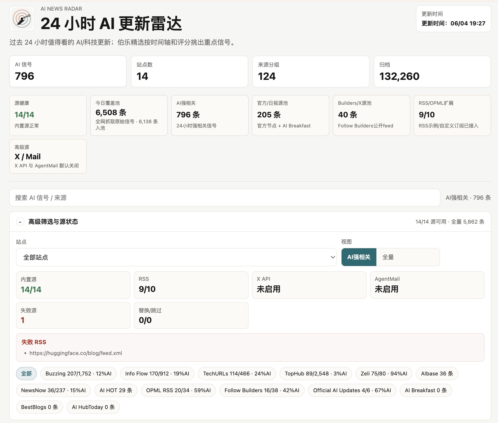
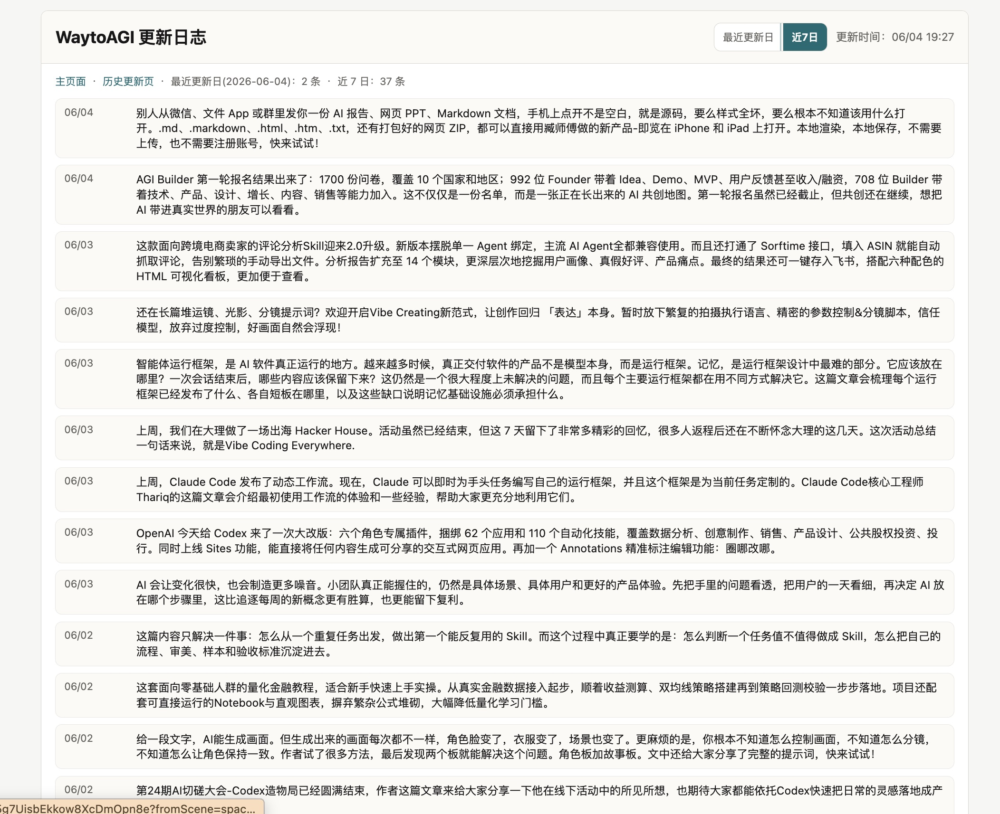
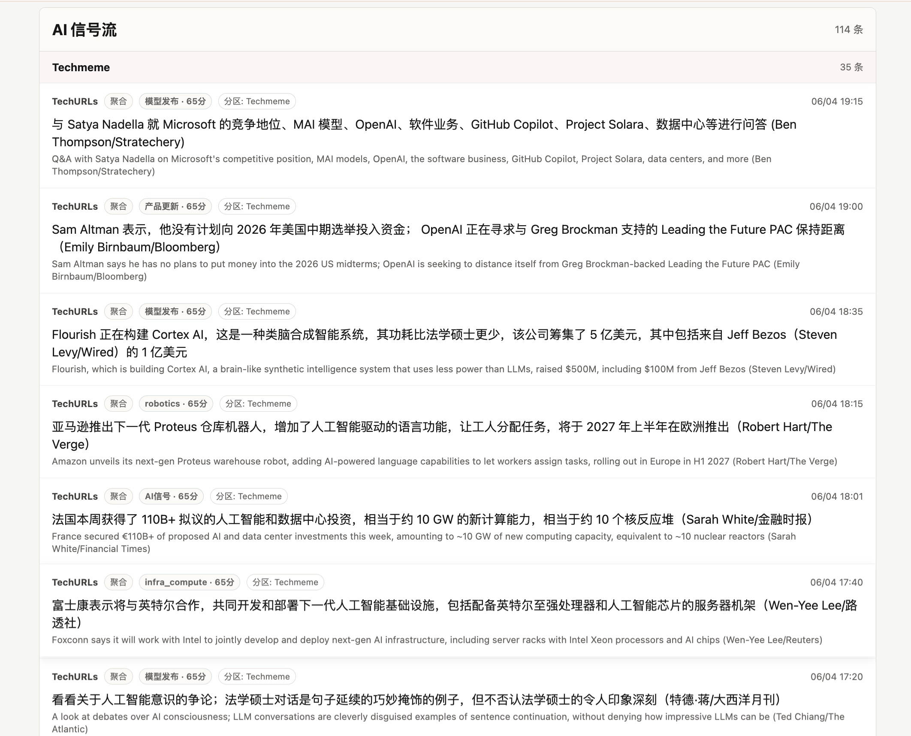

<div align="center">

# AI News Radar

## 24灏忔椂AI鏇存柊闆疯揪锝滀集涔怱kill

**浼箰Skill锛圫cout Skill锛夊府浣犱粠涓€鍫嗕俊婧愰噷閫夊嚭鍗冮噷椹紝骞舵妸鍒嗘暎娑堟伅鍚堝苟鎴愬彲杩借釜鐨凙I鏁呬簨绾裤€?*

[](https://github.com/LearnPrompt/ai-news-radar/stargazers)
[](https://learnprompt.github.io/ai-news-radar/)
[](https://github.com/LearnPrompt/ai-news-radar/actions/workflows/update-news.yml)
[](skills/radar/README.md)
[](LICENSE)

[鍦ㄧ嚎椤甸潰](https://learnprompt.github.io/ai-news-radar/) 路 [English](README.en.md) 路 [闆疯揪Skill](skills/radar/README.md) 路 [浼箰Skill](skills/ai-news-radar/README.md) 路 [淇℃伅婧愮瓥鐣(docs/SOURCE_COVERAGE.md)

</div>

---

## 30绉掗€夎竟涓婅溅

**鈶?鍙兂鐪婣I鏃ユ姤** 鈫?涓嶇敤瑁呬换浣曚笢瑗匡紝鐩存帴鎵撳紑[鍦ㄧ嚎椤甸潰](https://learnprompt.github.io/ai-news-radar/)銆?

**鈶?鎯宠Agent鏇夸綘璇?* 鈫?瑁呴浄杈維kill锛坅i-radar锛夛紝闆禔PI銆侀浂Key銆侀浂鏈嶅姟鍣細

```bash
npx skills add LearnPrompt/ai-news-radar -s ai-radar -g
```

瑁呭畬瀵笰gent璇翠竴鍙ワ細`浠婂ぉAI鍦堟湁浠€涔堬紵`


**鈶?鎯宠涓€涓畬鍏ㄥ睘浜庤嚜宸辩殑闆疯揪** 鈫?fork鏈粨搴擄紝璁╁唴缃殑[浼箰Skill](skills/ai-news-radar/README.md)甯綘褰曞叆淇℃簮銆侀儴缃睪itHub Pages銆備俊婧愪綘閫夛紝鏁版嵁褰掍綘銆?

涓夊眰鏄竴鏉¤矾锛氱湅鎶?鈫?璁〢gent璇绘姤 鈫?鑷繁鍔炴姤銆?

---

## 杩欐槸浠€涔?

AI News Radar鏄竴涓嚜鍔ㄦ洿鏂扮殑24灏忔椂AI鏇存柊闆疯揪銆傚畠涓嶅彧鏄妸AI鏂伴椈鎶撳洖鏉ワ紝浼氬厛鍒ゆ柇淇℃伅婧愯川閲忥紝鎶婂悓涓€涓簨浠跺悎骞舵垚鏁呬簨绾匡紝鏈€鍚庣敤浼箰Skill绮鹃€夈€丄I鏍囩銆佹簮鍋ュ悍鍜孉I鍗犳瘮甯綘鍒ゆ柇锛?

浠€涔堜俊鎭€煎緱鐪嬶紝浠€涔堝€煎緱娣辨寲锛屼粈涔堝彧鏄櫔闊炽€?

鏅€氱敤鎴风洿鎺ユ墦寮€缃戦〉锛岀湅鏈€杩?4灏忔椂AI銆佹ā鍨嬨€佸紑鍙戣€呭伐鍏峰拰鎶€鏈敓鎬佹洿鏂般€傚紑鍙戣€呭彲浠ork杩欎釜浠撳簱锛屾帴鍏ヨ嚜宸辩殑OPML/RSS銆佸叕寮€feed銆侀潤鎬侀〉闈㈡垨AgentMail閭銆侰odex / Claude Code杩欑被 Agent 鍙互浣跨敤椤圭洰鍐呯疆鐨?**浼箰Skill**锛岀户缁府浣犲垽鏂柊鐨勪俊鎭簮銆佺淮鎶ゆ姄鍙栭€昏緫銆侀儴缃?GitHub Pages銆?

杩欎釜椤圭洰姘歌繙閮戒笉浼氭槸鈥滃張涓€涓柊闂荤綉椤碘€濄€?

瀹冪殑鏍稿績閫昏緫鏄?*浼箰Skill**锛屽府浣犱粠涓€鍫嗕俊婧愰噷閫夊嚭鍗冮噷椹€傚摢浜涙簮鍊煎緱闀挎湡杩借釜锛屽摢浜涙簮閫傚悎鍋氭垚RSS/OPML锛屽摢浜涙簮鍙兘鎺ヤ粯璐圭殑API锛屽摢浜涙簮鐪嬭捣鏉ユ洿鏂板緢澶氫絾瀹為檯涓婅窡浣犻暱鏈熷叧娉ㄧ殑鏂归潰姣旀柟AI鍙崰浜嗛噷闈㈢殑5%涓嶅埌銆?

鍏堝垽鏂竻妤氾紝鍐嶆帴鍏ャ€?

<table>
  <tr>
    <td></td>
    <td></td>
  </tr>
  <tr>
    <td></td>
    <td></td>
  </tr>
</table>

## 涓轰粈涔堥渶瑕佷集涔怱kill

濂芥柊闂诲垎鏁ｅ湪鍚勫锛?

瀹樻柟鍗氬鍙戜竴鐐癸紝鏇存柊鏃ュ織鍙戜竴鐐癸紝X涓婃湁浜烘彁鍓嶇垎鏂欙紝鑱氬悎绔欏張鎶婂悓涓€涓柊闂昏浆鏉ヨ浆鍘汇€?

鎴戜互涓虹殑鑷繁鍦ㄨ拷鍓嶆部锛屽疄闄呮瘡澶╅兘鍦ㄩ噸澶嶄笁浠朵簨锛?

鎵撳紑鍑犲崄涓〉闈紝鑲夌溂+浜鸿剳杩囨护閲嶅鍐呭锛岀寽鍝潯鍊煎緱鐪嬨€?

璁╀集涔怱kill鍏堟浛浣犲畬鎴愮涓€杞垽鏂紝**鍝簺淇℃簮鏄崈閲岄┈锛屽摢浜涙槸鍣煶**銆?

浣犲彲浠ラ殢鎰忓鍔犱俊鎭簮锛岃繕鍙互鎶婁竴涓俊鎭簮绾冲叆杈撳叆鑼冨洿锛屽厛璁╁畠鍦ㄥ崟鐙繍琛屼竴鍛紝鍐嶅垽鏂涓嶈褰曞叆銆?

AI News Radar浠庢潵閮戒笉鏄崟绾妸淇℃伅鎶撳洖鏉ワ紝

瀹冩洿鍍忔槸涓€鏉¤交閲忕殑鏂伴椈pipeline锛屾妸鏉ユ簮鍒ゆ柇銆佹姄鍙栥€佸幓閲嶃€丄I寮虹浉鍏宠繃婊ゃ€佷俊鎭簮鍋ュ悍鐘舵€佸拰闈欐€佺綉椤靛彂甯冧覆璧锋潵锛屼笂绾垮悗涓嶆秷鑰楁ā鍨嬮搴︺€?

## 鑳藉仛浠€涔?

### 缁欐櫘閫氳鑰?

- 鎵撳紑鍦ㄧ嚎椤甸潰锛岀洿鎺ョ湅鏈€杩?4灏忔椂AI銆佹ā鍨嬨€丄gent銆佸紑鍙戣€呭伐鍏峰拰鎶€鏈敓鎬佹洿鏂?
- 閫氳繃鈥滀集涔愮簿閫夆€濆厛鐪嬮珮浠峰€兼晠浜嬬嚎锛屽啀涓嶇敤浠庡嚑鐧炬潯娑堟伅閲岃倝鐪肩瓫閫?
- 鍦ㄢ€淎I淇″彿娴佲€濋噷缁х画鏌ョ湅瀹屾暣AI寮虹浉鍏虫秷鎭?
- 鐢ㄧ珯鐐广€佸叧閿瘝銆佹椂闂村拰鏉ユ簮绛涢€夊揩閫熷畾浣嶄俊鎭?
- 鐪嬪埌姣忔潯娑堟伅鐨凙I鏍囩銆丄I鐩稿叧鎬у垎鏁般€佹潵婧愬钩鍙板拰鍙戝竷鏃堕棿
- 閫氳繃婧愬仴搴峰拰AI鍗犳瘮鍒ゆ柇锛氬摢浜涙簮鏄湡鏈夋枡锛屽摢浜涙簮鏇存柊寰堝浣咥I鍚噺浣?

### 缁欏唴瀹瑰垱浣滆€?

- 淇濈暀鍘熷鏉ユ簮閾炬帴锛屾柟渚跨户缁繁鎸栥€佹牳瀵逛簨瀹炲拰鍋氶€夐
- 鎶婂悓涓€涓簨浠剁殑澶氫釜鏉ユ簮鑱氬悎鍒颁竴璧凤紝鍑忓皯閲嶅闃呰
- 鐢ˋI鏍囩蹇€熷垽鏂竴鏉℃秷鎭€傚悎鍋氬浘鏂囥€佺煭瑙嗛銆佽繕鏄伐鍏峰疄娴?
- 鐢ㄥ婧愰噸鍚堛€佸畼鏂逛竴鎵嬨€佸崟婧愯瀵熺瓑淇″彿鍒ゆ柇閫夐鍙俊搴﹀拰浼樺厛绾?

### 缁欏紑鍙戣€呭拰Agent

- 榛樿涓嶉渶瑕?API Key銆佷笉闇€瑕佺櫥褰曟€併€佷笉闇€瑕?LLM棰濆害
- 鏀寔瀹樻柟 RSS/changelog銆丱PML/RSS銆佸叕寮€ GitHub feed/JSON銆侀潤鎬侀〉闈€丄gentMail 绛夋潵婧愮被鍨?
- GitHub Actions鑷姩鐢熸垚 `data/*.json` 骞跺彂甯冨埌 GitHub Pages
- Codex / Claude Code / Hermes / OpenClaw 鍙互閫氳繃椤圭洰鍐呯疆鐨勪集涔怱kill缁х画缁存姢淇℃簮銆佹姄鍙栭€昏緫鍜岄〉闈?
- 楂樼骇鏉ユ簮鍙互閫氳繃 GitHub Secrets鎴栨湰鍦扮幆澧冨彉閲忔帴鍏ワ紝閬垮厤鎶?token銆乧ookies銆佺鏈?OPML 鍜岄偖绠辨鏂囧啓杩涗粨搴?

## v0.7锛氫粠鏃堕棿绾垮埌鐑偣闆疯揪

v0.6 鎶婂垎鏁ｇ殑娑堟伅鍚堝苟鎴愪簡鏁呬簨绾裤€倂0.7 鍥炵瓟鐨勬槸涓嬩竴涓棶棰橈細

**鏁呬簨澶氫簡涔嬪悗锛屾€庝箞鐭ラ亾鐜板湪浠€涔堟渶鐑紵**

v0.7 鍋氫簡鍥涗欢浜嬶細

- **褰撳墠鐑偣瑙嗗浘**锛氫集涔愮簿閫夋柊澧炵儹鐐规ā寮忥紝鎸夊婧愯仛绨?脳 鏃堕棿琛板噺鎺掑簭鈥斺€斿嚑涓嫭绔嬩俊婧愬悓鏃跺湪璇寸殑浜嬶紝鎵嶉厤鍙儹鐐广€傛病鏈夎冻澶熷婧愮儹鐐规椂锛岃繖涓鍥捐嚜鍔ㄩ殣钘忋€?
- **瀹佺己姣嬫互闂ㄦ**锛氱簿閫夊腑浣嶅繀椤婚潬澶氭簮纭鎴栭珮鍒嗘專鏉ワ紝瀹夐潤鐨勬棩瀛愮簿閫夊尯鐩存帴娑堝け锛屼笉鐣欑┖澹筹紝椤甸潰鍥炲埌绾椂闂磋酱銆?
- **璇勫垎鍥炴祴宸ュ叿**锛歚scripts/backtest_scoring.py` 鎶婁换鎰忎袱涓増鏈殑璇勫垎閫昏緫鍦ㄥ巻鍙叉。妗堜笂閲嶆斁瀵规瘮銆傜珛涓嬭鐭╋細鍔ㄨ瘎鍒嗗繀椤婚檮甯?鈮?4 澶╁洖娴嬫姤鍛娿€?
- **ai-radar 娑堣垂Skill**锛氳涓婂悗瀵笰gent璇?浠婂ぉAI鍦堟湁浠€涔?锛屽畠鐩存帴璇绘湰绔欏叕寮€JSON鍑轰腑鏂囩畝鎶モ€斺€旈浂API銆侀浂Key锛屾暟鎹閬撳彲fork銆?

v0.6 寮曞叆鐨勬晠浜嬬嚎鍚堝苟銆丄I鏍囩鍒嗘暟銆佹簮鍋ュ悍涓嶢I鍗犳瘮锛屼粛鏄繖涓€鍒囩殑鍦板熀銆傚巻娆℃敼鍔ㄨ [Releases](https://github.com/LearnPrompt/ai-news-radar/releases)銆?

## 宸ヤ綔鍘熺悊

```mermaid
flowchart LR
    source["淇℃伅婧愭竻鍗?] --> classify["浼箰Skill鍒ゆ柇淇℃簮绫诲瀷"]

    classify --> official["瀹樻柟 RSS / changelog"]
    classify --> opml["绉佷汉 OPML / RSS"]
    classify --> publicFeed["鍏紑 GitHub feed / JSON"]
    classify --> staticPage["鍏紑椤甸潰 / Jina 鍏滃簳"]
    classify --> privateMail["AgentMail 閭璁㈤槄"]
    classify --> skip["璺宠繃楂橀闄╂潵婧?]

    official --> fetch["鎶撳彇涓庣粨鏋勫寲"]
    opml --> fetch
    publicFeed --> fetch
    staticPage --> fetch
    privateMail --> fetch

    fetch --> dedup["鍘婚噸涓庡綊涓€鍖?]
    dedup --> score["AI鐩稿叧鎬ц瘎鍒嗕笌鏍囩"]
    score --> story["鏁呬簨鍚堝苟涓庡婧愯瘉鎹仛鍚?]
    score --> status["婧愬仴搴蜂笌AI鍗犳瘮缁熻"]

    story --> brief["浼箰绮鹃€?/ daily-brief.json"]
    story --> merged["stories-merged.json / merge-log.json"]
    status --> sourceData["source-status.json"]
    score --> latest["latest-24h.json / latest-24h-all.json"]

    brief --> pages["GitHub Pages缃戦〉"]
    merged --> pages
    sourceData --> pages
    latest --> pages

    pages --> agent["浼箰Skill锛欰gent 缁х画缁存姢淇℃簮"]
    pages --> radar["ai-radar Skill锛欰gent 璇绘姤鍑虹畝鎶?]
```

AI News Radar瀛︿範浜嗙幇浠ｆ柊闂诲鐨勬妧鏈紝涓嶆槸绠€鍗曞爢淇℃伅婧愶紝涓€娆℃€ф斁鍑犱竾鏉′俊鎭嚭鏉ョ瓑浜庢病鐢紝鎵€浠ユ垜閫夋嫨鎶婃柊闂诲鐞嗘媶鎴愮ǔ瀹歱ipeline锛屾姄鍙栵紝鍘婚噸锛岃繃婊わ紝琛ュ厖鐘舵€侊紝鐢熸垚闈欐€佺珯鐐广€?

鍦ㄤ繚璇佺ǔ瀹氭€х殑鍚屾椂杩芥眰杞婚噺鍖栵紝鍏紑鐗堜笉瑕佹眰鐢ㄦ埛閰嶇疆LLM API Key锛屼笉渚濊禆鐧诲綍鎬侊紝cookies锛孹 API鍜岄偖绠便€傞渶瑕佽繖浜涜繘闃惰兘鍔涙椂锛屽彲浠ラ€氳繃浼箰Skill鐢℅itHub Secrets鎴栨湰鍦扮幆澧冨彉閲忔帴鍏ャ€?

## 鏁版嵁浜х墿

姣忔鏇存柊浼氱敓鎴愪竴缁勯潤鎬丣SON鏂囦欢锛岄〉闈㈠彧璇诲彇杩欎簺鏂囦欢锛屼笉闇€瑕佸悗绔湇鍔°€?

鏍稿績鏂囦欢鍖呮嫭锛?

- `data/latest-24h.json`锛氭渶杩?4灏忔椂AI寮虹浉鍏虫秷鎭?
- `data/latest-24h-all.json`锛氭渶杩?4灏忔椂鍏ㄩ噺娑堟伅
- `data/source-status.json`锛氭潵婧愭姄鍙栫姸鎬併€佹垚鍔熺巼銆佺珯鐐硅鐩栧拰婧愬仴搴?
- `data/daily-brief.json`锛氫集涔愮簿閫夋晠浜嬬嚎锛屼緵棣栭〉楂樹环鍊兼椂闂寸嚎浣跨敤
- `data/stories-merged.json`锛氭晠浜嬪悎骞跺悗鐨勫畬鏁翠簨浠堕泦鍚?
- `data/merge-log.json`锛氭晠浜嬪悎骞惰繃绋嬪拰鍛戒腑璁板綍锛屾柟渚胯皟璇曚笌瀹¤

濡傛灉 `daily-brief.json` 鏆傛椂涓嶅瓨鍦紝椤甸潰浼氬洖閫€鍒板€欓€変俊鍙峰垪琛紱濡傛灉瀹冨瓨鍦ㄤ絾褰撳ぉ娌℃湁澶熸牸鐨勬晠浜嬶紙瀹佺己姣嬫互闂ㄦ锛夛紝绮鹃€夊尯浼氭暣浣撻殣钘忥紝椤甸潰鍥炲埌绾椂闂磋酱銆?

## 蹇€熷紑濮?

鏅€氱敤鎴蜂笉鐢ㄥ畨瑁咃紝鐩存帴鎵撳紑鍦ㄧ嚎椤甸潰鍗冲彲銆?

鎯砯ork鏀归€犳柊鐗堟湰锛屽彲浠ユ湰鍦拌繍琛岋細

```bash
git clone https://github.com/LearnPrompt/ai-news-radar.git
cd ai-news-radar
python3 -m venv .venv
source .venv/bin/activate
pip install -r requirements.txt
python scripts/update_news.py --output-dir data --window-hours 24
python -m http.server 8080
```

鎵撳紑锛?

```text
http://localhost:8080
```

濡傛灉浣犳湁鑷繁鐨?OPML锛?

```bash
cp feeds/follow.example.opml feeds/follow.opml
# 鎶婅嚜宸辩殑璁㈤槄婧愬啓杩?feeds/follow.opml锛屼笉鎻愪氦杩欎釜鏂囦欢
python scripts/update_news.py --output-dir data --window-hours 24 --rss-opml feeds/follow.opml
```

## 缁橝gent鐪嬬殑鏁欑▼

濡傛灉浣犳兂璁〤odex / Claude Code / OpenClaw / Hermes甯綘鎼嚜宸辩殑鐗堟湰锛屽彲浠ョ洿鎺ヨ锛?

```text
璇蜂娇鐢ㄤ集涔怱kill锛屽厛闂垜瑕佷俊鎭簮娓呭崟锛岀劧鍚庡府鎴戝垽鏂瘡涓俊婧愯鐢≧SS銆佸叕寮€feed銆侀潤鎬侀〉闈€丣ina鍏滃簳銆丄gentMail閭杩樻槸璺宠繃銆傜洰鏍囨槸閮ㄧ讲涓€涓笉闇€瑕佹湇鍔″櫒銆佽兘鐢℅itHub Actions鑷姩鏇存柊鐨?AI 鏃ユ姤缃戠珯銆備笉瑕佹妸浠讳綍API Key銆乧ookies銆乼oken銆佺鏈夐偖浠跺唴瀹瑰啓鍏ヤ粨搴撱€?
```

椤圭洰鍐呯疆涓や釜 Skill锛屽垎宸ユ槸銆岄浄杈剧璇伙紝浼箰绠￠€夈€嶏細

- `skills/radar/`锛?*ai-radar 闆疯揪Skill**锛堟秷璐逛晶锛夆€斺€斾笉鐢╢ork灏辫兘瑁咃紝鑷劧璇█闂瓵I璧勮锛岃鏈珯鍏紑JSON鍑虹畝鎶?
- `skills/ai-news-radar/`锛?*浼箰Skill**锛堢淮鎶や晶锛夆€斺€攆ork鍚庣敤瀹冨綍鍏ヤ俊婧愩€佺淮鎶ゆ姄鍙栭€昏緫銆侀儴缃?GitHub Pages

鏂癆gent鎺ユ墜楠屾敹鏃讹紝鎺ㄨ崘鍏堣锛?

- `README.md`
- `README.en.md`
- `docs/GPT_HANDOFF.md`
- `docs/SOURCE_COVERAGE.md`
- `docs/V2_PRODUCT_BRIEF.md`

## GitHub 鑷姩鏇存柊

`.github/workflows/update-news.yml` 宸茬粡閰嶇疆濂藉畾鏃朵换鍔°€?

- 榛樿姣?30 鍒嗛挓杩愯涓€娆?
- 鑷姩鐢熸垚骞舵彁浜?`data/*.json`
- 濡傛灉娌℃湁璁剧疆 `FOLLOW_OPML_B64`锛岀嚎涓婂伐浣滄祦浼氳嚜鍔ㄤ娇鐢ㄥ叕寮€绀轰緥 `feeds/follow.example.opml`锛岃椤甸潰灞曠ず RSS/OPML 鑳藉姏
- 濡傛灉璁剧疆 `FOLLOW_OPML_B64`锛屼細浼樺厛鑷姩瑙ｇ爜涓虹鏈?`feeds/follow.opml`
- 濡傛灉璁剧疆 `EMAIL_DIGEST_ENABLED=1`銆乣AGENTMAIL_API_KEY`銆乣AGENTMAIL_INBOX_ID`锛屼細鐢熸垚鑴辨晱閭鎽樿
- 鍙湁棰濆璁剧疆 `EMAIL_DIGEST_PUBLISH=1`锛屾墠浼氭彁浜?`data/email-digest.json`
- 濡傛灉璁剧疆 `X_API_ENABLED=1`銆乣X_BEARER_TOKEN` 鍜岄绠楀彉閲忥紝浼氬湪姣忔棩鎸囧畾UTC绐楀彛鐢ㄥ畼鏂筙 API鎶撳彇灏戦噺鍏紑Post锛涢粯璁ゅ叧闂紝涓斿綋鍓峏 API鎸夎繑鍥炶祫婧愯璐?

榛樿鎯呭喌涓嬶紝鏈」鐩笉闇€瑕佷换浣旳PI Key灏辫兘璺戞牳蹇冩祦绋嬨€?

楂樼骇婧愰厤缃ā鏉胯 `examples/advanced-sources.env.example`锛?

棰勭畻璇存槑瑙?`docs/research/advanced-source-free-tier-budget-2026-05-10.md`锛?

X API婕旂ず閰嶇疆瑙?`docs/guides/x-api-demo-config.md`锛?

鍗曡处鍙?鍗昻ewsletter婕旂ず瑙?`docs/guides/rileybrown-alphasignal-demo.md`銆?

## License

[MIT](LICENSE)

